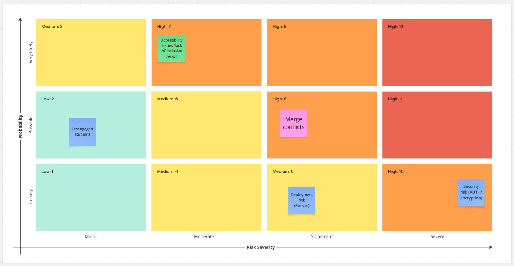
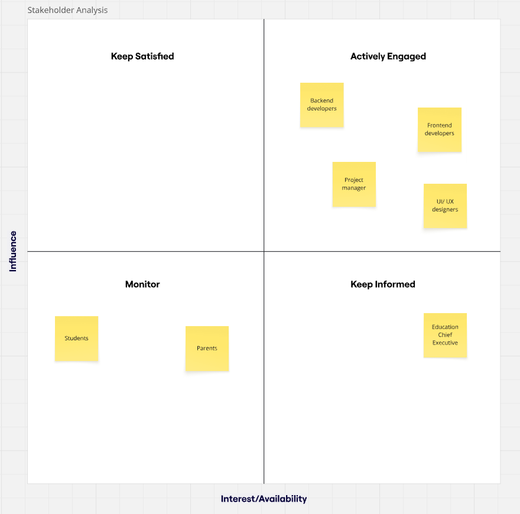

# Questry
---

> **_The management team of the Hive group of secondary schools has noticed a lack of engagement in non-STEM subjects over the last two years. They would like to try and reverse this trend and have asked an external team to come up with a solution that places student enjoyment at the heart of the learning experience._**

This application aims to fix the following issues that the Hive Foundation are having with:

- Student engagement issues
- Knowledge retention
- Repetitive teaching methods
- Reduced time for non-STEM subjects
- Student overwhelm
- Lack of confidence from parents for their students

---
## Deployment
**Live App: [https://educationapp-p97q.onrender.com/pages/index.html](https://educationapp-p97q.onrender.com/pages/index.html)**
> Deployed on Render — no installation required. Simply visit the link above to create an account and play.
---
## Features

| Feature        | Description                                                | Status      |
| -------------- | ---------------------------------------------------------- | ----------- |
| Authentication | User register, login & logout - securely                   | Complete    |
| Leaderboards   | Users game progress is automatically logged in leaderboard | In Progress |
| History quiz   | Multiple choice game                                       | Complete    |

---

## Risk Assessment



| Risk                                            | Mitigation                                                                                  |
| ----------------------------------------------- | ------------------------------------------------------------------------------------------- |
| Accessibility issues / lack of inclusive design | Future feature — audible text / voice feature and alternate colour schemes                  |
| Disengaged students                             | Game that engages users through multiple choice quizzes and leaderboards for competitivity  |
| Merge conflicts                                 | Constant communication and frequent pushing / pulling to the repo                           |
| Deployment risks                                | To be confirmed                                                                             |
| Security risks                                  | Implementing AUTH principles — bcrypt password hashing and JWT tokens                      |

---

## Stakeholder Analysis



---

## Project Structure

```
questry/
├── backend/
│   ├── controllers/
│   │   ├── leaderboard.js
│   │   ├── question.js
│   │   └── user.js
│   ├── db/
│   │   ├── connect.js
│   │   ├── histories.sql
│   │   └── setup.js
│   ├── models/
│   │   ├── Leaderboard.js
│   │   ├── Question.js
│   │   └── User.js
│   ├── routers/
│   │   └── histories.js
│   ├── app.js
│   └── index.js
├── frontend/
│   ├── css/
│   ├── js/
│   └── pages/
├── package.json
└── README.md
```

---

## Technologies

| Area     | Technology                      |
| -------- | ------------------------------- |
| Frontend | HTML5, CSS3, Vanilla JavaScript |
| Backend  | Node.js, Express.js             |
| Database | PostgreSQL (hosted on Supabase) |
| Auth     | bcrypt, JSON Web Tokens (JWT)   |
| Testing  | Jest, jsdom                     |
| Other    | js-confetti, Morgan, CORS       |

---

## Process

- Planned the database schema first, mapping out `question`, `answer`, `account`, and `leaderboard` tables.
- Built the backend API with Express, implementing auth routes (register/login), question routes, and leaderboard routes.
- Developed the frontend sign-up and login forms, connecting them to the API with `fetch`.
- Built two interactive history games — Tudor England (API-driven questions) and Ancient Egypt (locally defined questions).
- Added win/lose audio effects and confetti animations to improve student engagement.
- Wrote unit and integration tests across both frontend and backend using Jest.

---

## Wins & Challenges

### Wins

- Clean separation between frontend and backend with a RESTful API.
- Secure authentication using hashed passwords and JWT tokens.
- Good test coverage across auth flows, question rendering, and game logic.
- Full deployed

### Challenges

- Managing async question fetching in the game — ensuring questions loaded before the user clicked Start required careful handling of promises.
- Mocking third-party libraries (JSConfetti) in Jest tests since they are loaded via CDN in the browser.

---

## Bugs

- Game 3 (WWII) is not yet implemented — clicking it shows a placeholder alert.
- No error handling if the backend is unreachable — games that fetch from the API will silently fail to load questions.
- Leaderboard feature is in progress and not yet fully connected to game completions.

---

## Future Features

- Complete Game 3 (WWII themed quiz).
- Fully working leaderboard that automatically updates on game completion.
- Teacher dashboard to view student progress.
- Mobile responsive layout improvements.
- Accessibility features — screen reader support and alternative colour schemes.