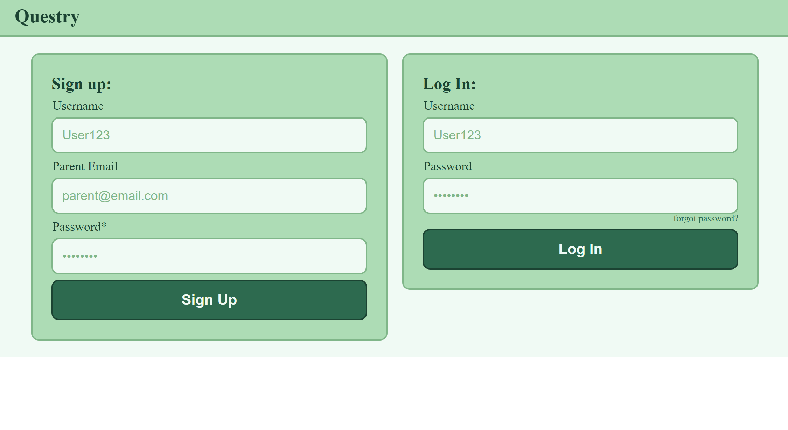
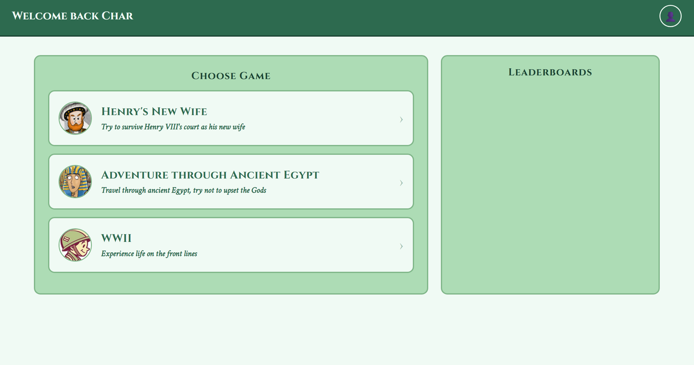
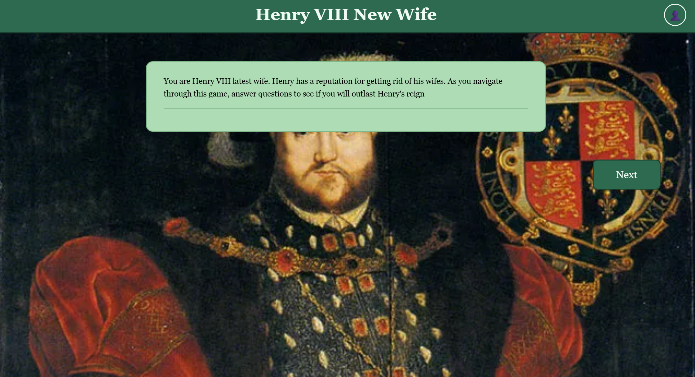

# Questry — Frontend

A history-themed educational quiz game for children. Players choose from a selection of interactive story-based games and answer questions to progress through historical scenarios.

---

## Installation & Usage

### Installation

- Clone or download the repository.
- Ensure the backend server is running (see backend README).

### Usage

- Open `index.html` in your browser, or navigate to the hosted URL.
- Sign up for an account or log in with existing credentials.
- From the home page, choose a game to play.
- Answer questions correctly to progress — one wrong answer and you start again!

## Screenshots

| Login Page | Home Page | Game Page |
|---|---|---|
| ||
---

## Wins & Challenges

### Wins

- 2 X working games
- Test coverage is good
- MVP in place (mostly)
### Challenges

- Mocking `JSConfetti` in Jest — it is loaded via a CDN script tag in the browser, so it needed to be mocked on `global` before the module was required in tests.
- Managing async `fetch` calls in tests required careful use of `await Promise.resolve()` to let the module's top-level async functions settle before assertions ran.

---

## Bugs

- No error handling if the backend is unreachable — the game will silently fail to load questions.
- Game 3 (WWII) is not yet implemented and shows an alert placeholder.
- Leaderboard is not implemented in the front end

---

## Future Features

- Leaderboard displaying top scores per game, it is currently hard coded
- Timer mechanic to add difficulty.
